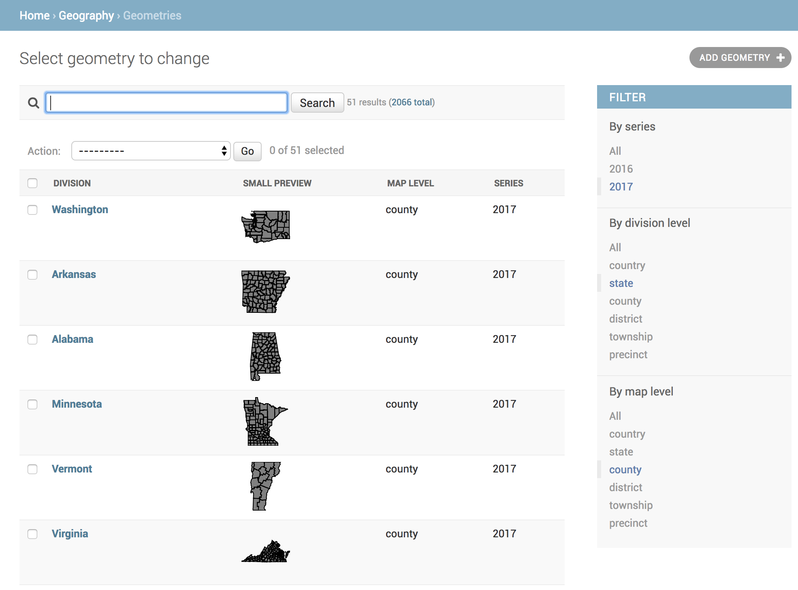

.. image:: https://rawgithub.com/The-Politico/src/master/images/logo/badge.png

.. image:: https://badge.fury.io/py/politico-civic-geography.svg
    :target: https://badge.fury.io/py/politico-civic-geography

politico-civic-geography documentation
======================================

.. toctree::
   :caption: Read the docs:
   :maxdepth: 2

   Why this? <why>
   Quickstart <quickstart>
   Models <models>
   Management <management>

Links
-----
- Code: `https://github.com/The-Politico/politico-civic-geography <https://github.com/The-Politico/politico-civic-geography>`_
- Issues: `https://github.com/The-Politico/politico-civic-geography/issues <https://github.com/The-Politico/politico-civic-geography/issues>`_
