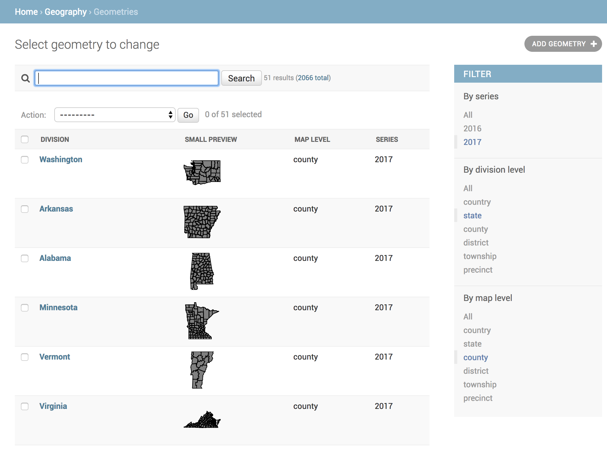

Quickstart
==========

Requirements
------------
- topojson
- PostgreSQL ≥ 9.4
- Django ≥ 2.0

Install
-------

.. code:: shell

  $ pip install politico-civic-geography

Configure
---------

1. Add the app and Django Rest Framework to the installed apps in your project settings and configure app specific settings.

  .. code::

    # settings.py

    INSTALLED_APPS = [
        # ...
        "rest_framework",
        "geography",
    ]

    CENSUS_API_KEY = os.getenv("CENSUS_API_KEY")
    GEOGRAPHY_AWS_ACCESS_KEY_ID = os.getenv("AWS_ACCESS_KEY_ID")
    GEOGRAPHY_AWS_SECRET_ACCESS_KEY = os.getenv("AWS_SECRET_ACCESS_KEY")
    GEOGRAPHY_AWS_S3_BUCKET = os.getenv("AWS_S3_BUCKET")
    GEOGRAPHY_AWS_REGION = "us-east-1"
    GEOGRAPHY_AWS_S3_UPLOAD_ROOT = "election-results/cdn"
    GEOGRAPHY_AWS_ACL = "public-read"
    GEOGRAPHY_AWS_CACHE_HEADER = "max-age=3600"

2. Add the app to your project's urlconf.

  .. code::

    # urls.py

    urlpatterns = [
        # ...
        path('geography', include('geography.urls')),
    ]

Bootstrap
---------

Bootstrap your database with geographic data from the U.S. Census Bureau. Running this command will create Geography and Geometry fixtures for states, counties, congressional districts and townships.

.. code:: shell

  $ python manage.py bootstrap_geography

See :ref:`management` for more details on using this command and on baking geometry TopoJSON files to AWS S3.

Run
---

Start the server to see your new fixture in Django's admin.

.. code:: shell

  $ python manage.py runserver

